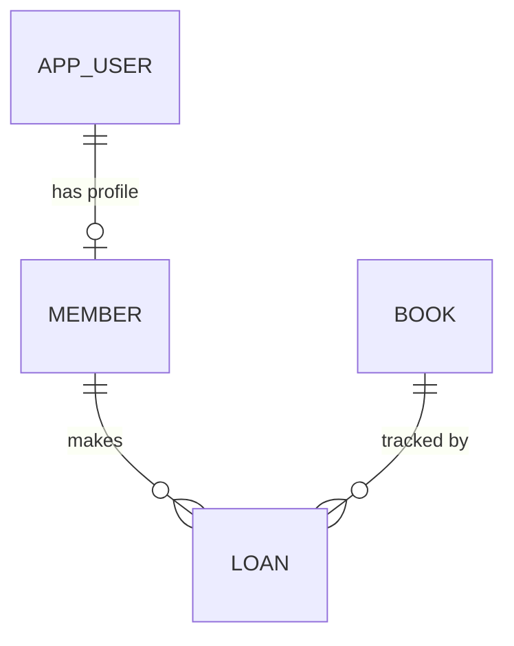

# Entity Model

## Entity Relationship Diagram

### APP_USER

Holds authentication credentials and role for every user in the system.

| Attribute     | Description                      | Data Type | Length/Precision | Validation Rules              |
|---------------|----------------------------------|-----------|------------------|-------------------------------|
| id            | Unique identifier                | Long      | 19               | Primary Key, Sequence         |
| username      | Login name used to authenticate  | String    | 60               | Not Null, Unique              |
| password_hash | Bcrypt hash of the user password | String    | 120              | Not Null                      |
| role          | Access role of the user          | String    | 20               | Not Null, Values: MEMBER, LIBRARIAN |
| created_at    | Timestamp when account was created | DateTime | -               | Not Null                      |

### MEMBER

Library patron profile linked to an APP_USER account.

| Attribute  | Description                              | Data Type | Length/Precision | Validation Rules              |
|------------|------------------------------------------|-----------|------------------|-------------------------------|
| id         | Unique identifier                        | Long      | 19               | Primary Key, Sequence         |
| user_id    | Reference to the associated login account | Long     | 19               | Not Null, Foreign Key (APP_USER.id) |
| name       | Full name of the member                  | String    | 100              | Not Null                      |
| email      | Email address of the member              | String    | 150              | Not Null, Format: Email       |
| created_at | Timestamp when member record was created | DateTime | -                | Not Null                      |

### BOOK

A book title in the catalog, with copy counts for availability tracking.

| Attribute        | Description                               | Data Type | Length/Precision | Validation Rules      |
|------------------|-------------------------------------------|-----------|------------------|-----------------------|
| id               | Unique identifier                         | Long      | 19               | Primary Key, Sequence |
| title            | Title of the book                         | String    | 200              | Not Null              |
| author           | Author of the book                        | String    | 150              | Not Null              |
| isbn             | International Standard Book Number       | String    | 20               | Optional              |
| total_copies     | Total number of physical copies owned    | Integer   | 10               | Not Null, Min: 1      |
| available_copies | Number of copies not currently on loan   | Integer   | 10               | Not Null, Min: 0      |

**Constraints:** available_copies must be less than or equal to total_copies.

### LOAN

Records a single borrow transaction between a member and a book copy.

| Attribute   | Description                             | Data Type | Length/Precision | Validation Rules              |
|-------------|-----------------------------------------|-----------|------------------|-------------------------------|
| id          | Unique identifier                       | Long      | 19               | Primary Key, Sequence         |
| member_id   | Member who borrowed the book            | Long      | 19               | Not Null, Foreign Key (MEMBER.id) |
| book_id     | Book that was borrowed                  | Long      | 19               | Not Null, Foreign Key (BOOK.id) |
| borrowed_at | Timestamp when the book was borrowed    | DateTime  | -                | Not Null                      |
| returned_at | Timestamp when the book was returned    | DateTime  | -                | Optional                      |
| status      | Current state of the loan               | String    | 20               | Not Null, Values: ACTIVE, RETURNED |

**Constraints:** returned_at must be after borrowed_at when not null. status must be ACTIVE when returned_at is null, and RETURNED when returned_at is set.
